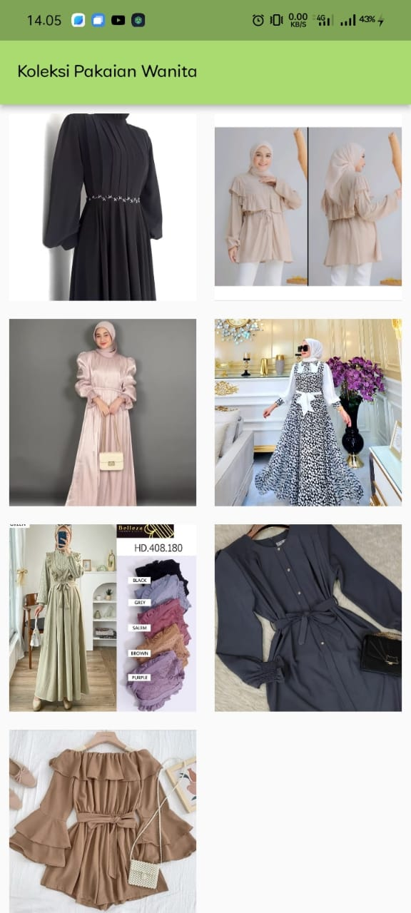
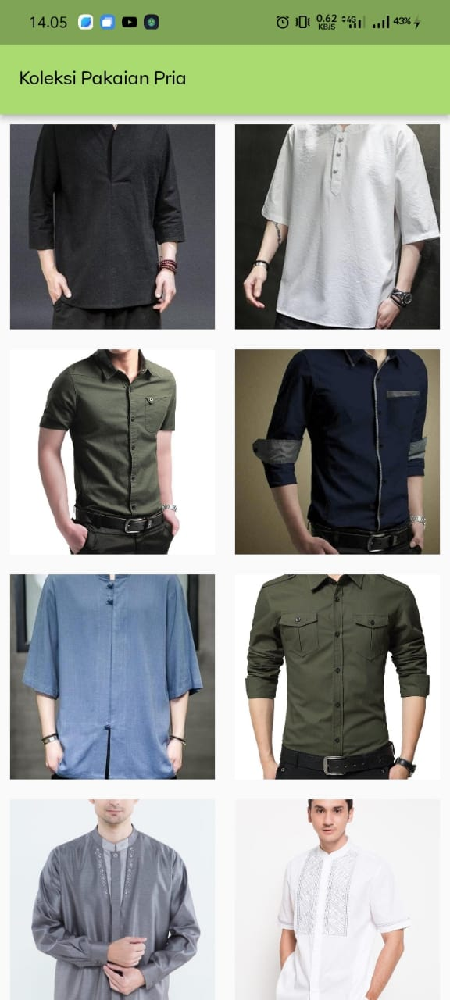
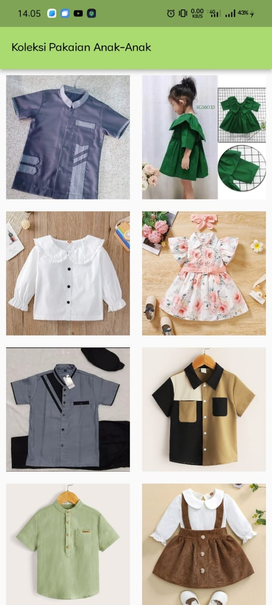
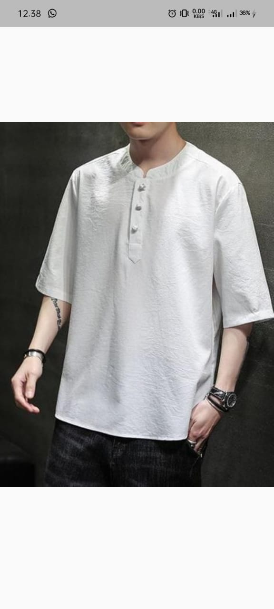
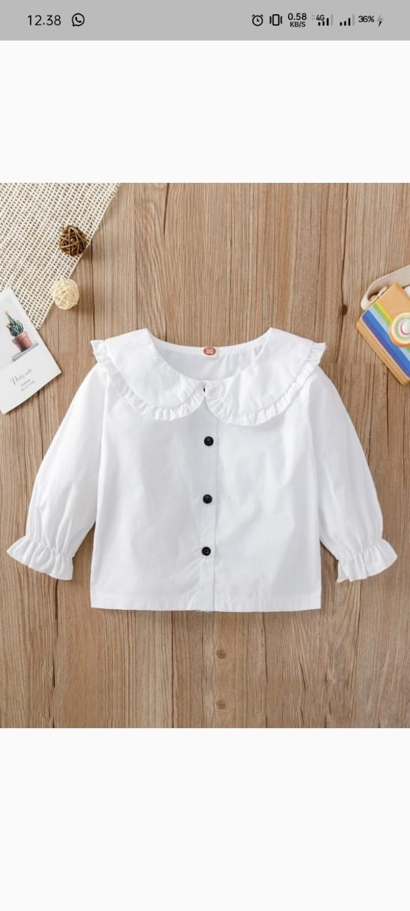

# Pencatatan Menjahit

Nama: Eka Yulianita Widyanti
NIM: 2131750002
Kelas: 2MI

-----------------------------------------------------
## Deskripsi
Aplikasi pencatatan menjahit adalah sebuah aplikasi yang dirancang untuk membantu penjahit dalam mencatat dan mengorganisir pekerjaan menjahit mereka. Aplikasi ini menyediakan berbagai fitur yang berguna untuk mengelola proses menjahit, termasuk:

1. Koleksi model baju yang pernah dibuat oleh penjahit
2. Pencatatan pesanan pelanggan. Penjahit dapat memasukkan detail pesanan seperti ukuran pakaian, model baju, tanggal pakaian yang akan diambil, harga dan keterangan.

---------------------------------------------------
## Tampilan Aplikasi
-------------------

1. Login

Penjelasan
2. Register

3. Koleksi

4. Koleksi Pakaian Wanita/ Pria/ Anak

5. Detail Pakaian Wanita/ Pria/ Anak

6. Catatan

7. Form Jahitan

8. Update Jahitan

9.Hapus

10. Detail Jahitan

11. Profil

