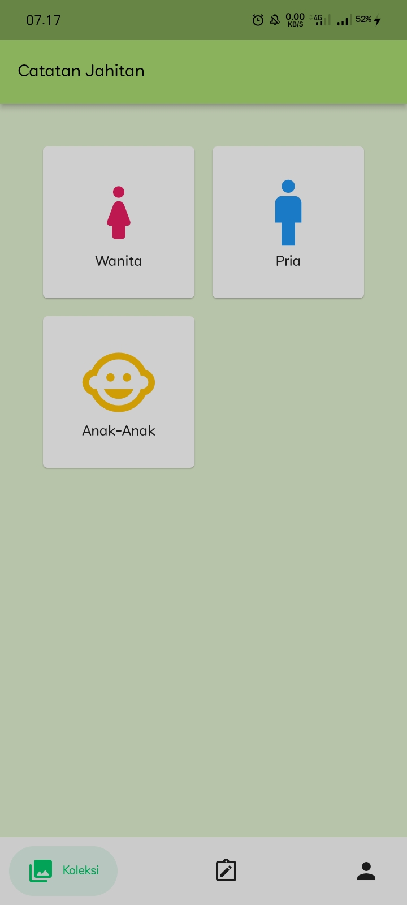

# Pencatatan Menjahit

Nama: Eka Yulianita Widyanti

NIM: 2131750002

Kelas: 2MI

-----------------------------------------------------
## Deskripsi
Aplikasi pencatatan menjahit adalah sebuah aplikasi yang dirancang untuk membantu penjahit dalam mencatat dan mengorganisir pekerjaan menjahit mereka. Aplikasi ini menyediakan berbagai fitur yang berguna untuk mengelola proses menjahit, termasuk:

1. Koleksi model baju yang pernah dibuat oleh penjahit
2. Pencatatan pesanan pelanggan. Penjahit dapat memasukkan detail pesanan seperti ukuran pakaian, model baju, tanggal pakaian yang akan diambil, harga dan keterangan.

---------------------------------------------------
## Tampilan Aplikasi
-------------------

1. Login

Penjelasan:

- Layout menggunakan StatefulWidget
- Terdapat image widget
- Terdapat card yang berisi form login, dengan ketentuan jika semua form diisi maka tombol login aktif. Tombol login menggunakan navigasi untuk pindah halaman koleksi
- Terdapat tombol google untuk melakukan login menggunakan firebase
- Terdapat text 'Dont have an account? Sign Up' menggunakan navigasi untuk pindah halaman ke halaman register

2. Register

Penjelasan:
- Layout Menggunakan StatefulWidget.
- Terdapat form untuk membuat akun
- Terdapat tombol Register menggunakan navigasi untuk pindah halaman login
- Terdapat text 'Already have an account? Login' menggunakan navigasi untuk pindah halaman ke halaman login

3. Koleksi

Penjelasan:
- Layout Menggunakan StatefulWidget.
- Terdapat 3 Card yang masing-masing card menuju ke halaman koleksi pakaian (menggunakan navigasi)

4. Koleksi Pakaian Wanita/ Pria/ Anak

Penjelasan:
- Layout menggunakan StatelessWidget
- Menggunakan list untuk menyimpan gambar
- Menggunakan navigasi push untuk menampilkan gambar

5. Detail Pakaian Wanita/ Pria/ Anak

Penjelasan:
- Layout menggunakan StatelessWidget
- Menggunakan navigasi pop untuk kembali ke koleksi pakaian

6. Catatan

Penjelasan

7. Form Jahitan

Penjelasan

8. Update Jahitan

Penjelasan

9.Hapus

Penjelasan

10. Detail Jahitan

Penjelasan

11. Profil

Penjelasan