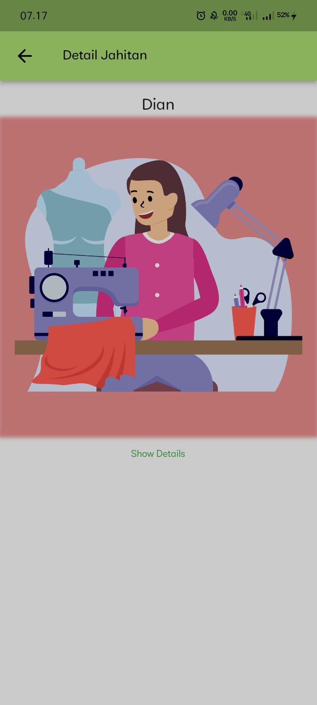

# Pencatatan Menjahit

Nama: Eka Yulianita Widyanti

NIM: 2131750002

Kelas: 2MI

-----------------------------------------------------
## Deskripsi
Aplikasi pencatatan menjahit adalah sebuah aplikasi yang dirancang untuk membantu penjahit dalam mencatat dan mengorganisir pekerjaan menjahit mereka. Aplikasi ini menyediakan berbagai fitur yang berguna untuk mengelola proses menjahit, termasuk:

1. Koleksi model baju yang pernah dibuat oleh penjahit
2. Pencatatan pesanan pelanggan. Penjahit dapat memasukkan detail pesanan seperti ukuran pakaian, model baju, tanggal pakaian yang akan diambil, harga dan keterangan.

---------------------
## Cara Running Aplikasi

----------------------

1. Login terlebih dahulu dengan mengisi email dan password, apabila tidak memiliki akun bisa dengan memilih login menggunakan google atau registrasi terlebih dahulu dengan cara menekan teks 'Dont have an account? Sign Up'. Jika tombol login belum aktif, pastikan semua form sudah terisi.
2. Melakukan registrasi dengan mengisi nama, email dan password, tekan tombol register maka akan muncul pop up 'Registration Successful... Ok'. Dan akan kembali ke halaman login. Jika menekan tombol register muncul validasi, pastikan semua form sudah terisi.
3. Lakukan login dengan mengisi sesuai dengan akun yang sudah di daftarkan.
4. Setelah login akan masuk ke halaman koleksi, terdapat tombol koleksi pakaian wanita, koleksi pakaian pria, dan koleksi pakaian anak. Apalabila ingin melihat koleksi tekan saja tombol yang diinginkan maka akn menuju ke halaman masing-masing koleksi.
5. Jika ingin membuat catatan pesanan jahitan. Pilih menu Catatan, tekan tombol +, isi semua form jahitan dan kemudian save maka akan tampil data yang baru saja diinputkan
6. Jika Ingin melihat data secara detal tekan selain di icon delete dan edit, maka akan tampil detail jahitan.
7. Jika ingin mencari catatan pesanan, klik pencarian kemudian masukkan kata kunci berdasarkan nama pemesan.
8. Jika ingin mengubah catatan pesanan, pilih icon edit, maka akan tampil form update data. Tekan save jika ingin mengubah data. 
9. Jika ingin menghapus data maka tekan icon delete. Secara otomatis data akan terhapus.
10. Pilih menu profil untuk melihat profil dan jika ingin keluar dari akun anda, tekan tombol sign out.

---------------------
## Tampilan Aplikasi
-------------------

1. Login

Penjelasan:

- Layout menggunakan StatefulWidget
- Terdapat image widget
- Terdapat card dan input data form login, dengan ketentuan jika semua form diisi maka tombol login aktif. Tombol login menggunakan navigasi untuk pindah halaman koleksi
- Terdapat tombol google untuk melakukan login menggunakan firebase
- Terdapat text 'Dont have an account? Sign Up' menggunakan navigasi untuk pindah halaman ke halaman register 

2. Register

Penjelasan:
- Layout Menggunakan StatefulWidget.
- Terdapat input data untuk membuat akun dengan ketentuan semua form harus diisi(menggunakan list).
- Terdapat tombol Register yang menampilkan 'Registration Successful... Ok', Dimana text Ok menggunakan TextButton dan menggunakan navigasi untuk pindah ke halaman login
- Terdapat text 'Already have an account? Login' menggunakan navigasi untuk pindah halaman ke halaman login

3. Koleksi

Penjelasan:
- Layout Menggunakan StatefulWidget.
- Terdapat 3 Card yang masing-masing card menuju ke halaman koleksi pakaian (menggunakan navigasi)

4. Koleksi Pakaian Wanita/ Pria/ Anak

Penjelasan:
- Layout menggunakan StatelessWidget
- Menggunakan list untuk menampilkan gambar
- Menggunakan gambar url untuk semua koleksi
- Menggunakan navigasi push untuk menampilkan gambar

5. Detail Pakaian Wanita/ Pria/ Anak

Penjelasan:
- Layout menggunakan StatelessWidget
- Menggunakan navigasi pop untuk kembali ke koleksi pakaian

6. Catatan

Penjelasan:
- Layout Menggunakan StatefulWidget.
- Terdapat tombol pencarian berdasarkan nama
- Terdapat tampilan data hasil input (Read data dari SQLite)
- Terdapat tombol tambah data yang menggunakan navigasi untuk pindah ke halaman entry data (Input data dari SQLite)
- Terdapat icon ubah yang menggunakan navigasi untuk pindah ke halaman update data (Update data dari SQLite)
- Terdapat icon hapus untuk menghapus data(delete data dari SQLite)

7. Form Jahitan

Penjelasan:
- Layout Menggunakan StatefulWidget.
- Terdapat form untuk input data terhubung dengan SQLite
- Terdapat tombol save(menyimpan data SQLite) dan cancel

8. Update Jahitan

Penjelasan:
- Layout Menggunakan StatefulWidget.
- Terdapat form untuk update data terhubung dengan SQLite
- Terdapat tombol save(menyimpan data SQLite) dan cancel

9.Hapus

Penjelasan:
- Menghapus data dengan menggunakan fungsi delete menggunakan id

10. Detail Jahitan

Penjelasan:
- Layout Menggunakan StatefulWidget.
- Menggunakan
- Terdapat animasi pada show details yang menampilkan data(Read data dari SQLite) 

11. Profil

Penjelasan:
- Layout Menggunakan StatefulWidget.
- Menampilkan data dari firebase login menggunakan akun google.
- Terdapat animasi pada tombol sign out
- Terdapat navigasi ke halaman login pada tombol sign out